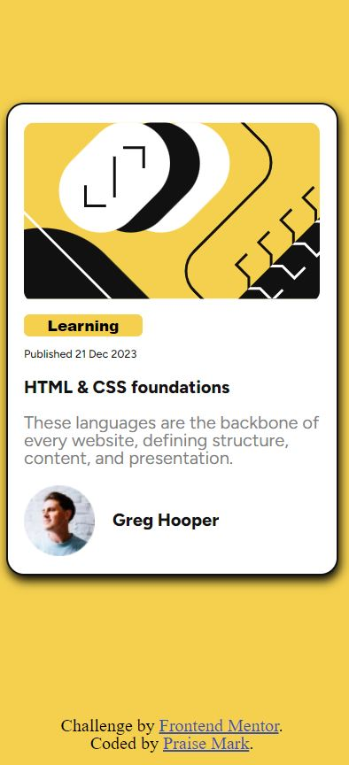

# Frontend Mentor - Blog preview card solution

This is a solution to the [Blog preview card challenge on Frontend Mentor](https://www.frontendmentor.io/challenges/blog-preview-card-ckPaj01IcS). Frontend Mentor challenges help you improve your coding skills by building realistic projects. 

## Table of contents

- [Overview](#overview)
  - [The challenge](#the-challenge)
  - [Screenshot](#screenshot)
  - [Links](#links)
- [My process](#my-process)
  - [Built with](#built-with)
  - [What I learned](#what-i-learned)
  - [Continued development](#continued-development)
  - [Useful resources](#useful-resources)
- [Author](#author)
- [Acknowledgments](#acknowledgments)

## Overview

The Project was executed with The Cube Csss technology in Mind.I didn't have to use media Queries for this project.FlexBox proof very Valuable

### The challenge

Didn't have Much Obstacle Building This Project

### Screenshot

### Links

- Solution URL: [Code]()
- Live Site URL: [Add live site URL here](https://your-live-site-url.com)

## My process

### Built with

- Semantic HTML5 markup
- CSS custom properties
- Flexbox
- CSS Grid
- Mobile-first workflow
-Cube CSS

### What I learned

I Used The proJect to improve on My design Skills.
-FlexBox
-Composition
-Cube CSS

### Continued development

Use this section to outline areas that you want to continue focusing on in future projects. These could be concepts you're still not completely comfortable with or techniques you found useful that you want to refine and perfect.

**Note: Delete this note and the content within this section and replace with your own plans for continued development.**

for yourself when you look back on this project in the future.**

## Author

- Frontend Mentor - [@MarkPraise](https://www.frontendmentor.io/profile/MarkPraise)
- Twitter - [@Praise5Mark](https://www.twitter.com/Praise5Mark)

